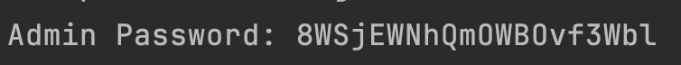
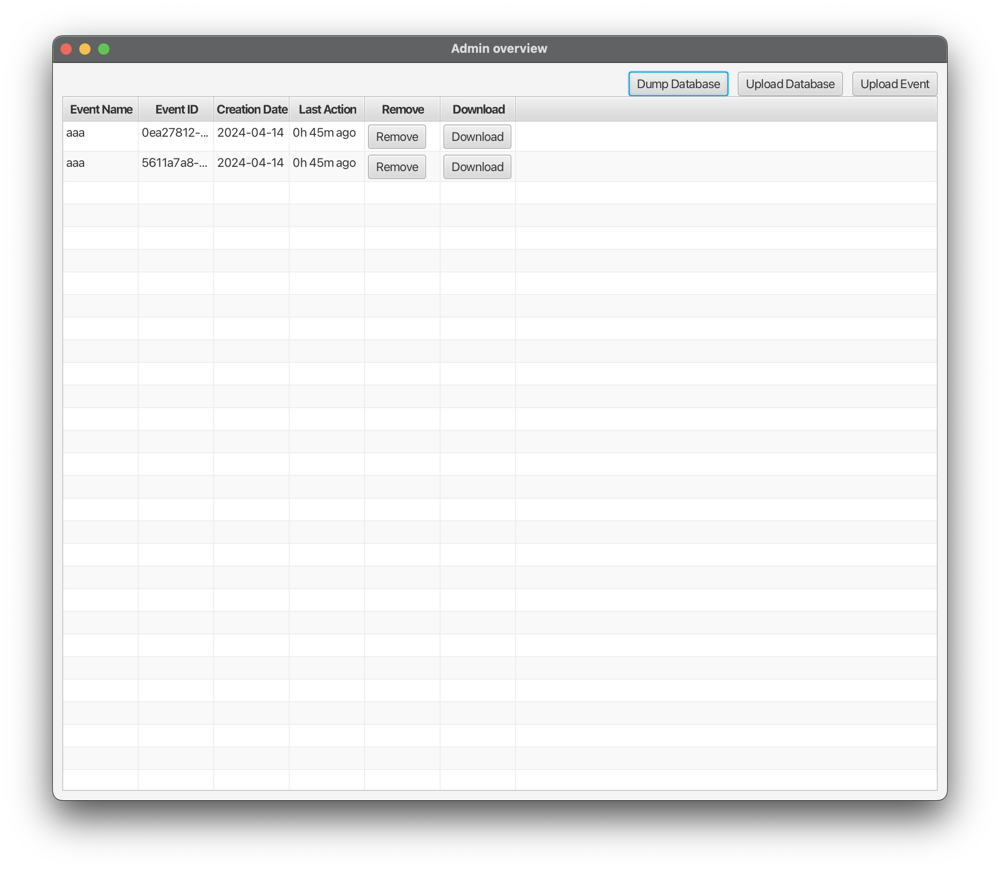

# OOPP team 12 - Splitty
> this project is still in its pre-release stage, so there may be small bugs

## Requirements
* `Java 21` is required to run this application
* commands should be run in a compatible shell such as: 
  * `bash`, `zsh`, `fish` for `Linux`/`MacOS`
  * `PowerShell` for `Windows`
## Config
### Server
To configure the server,
we recommend that you modify these
two lines in [application.properties](server/src/main/resources/application.properties):
```properties
server.address=localhost
server.port=8080
```
### Client
To configure the client, we have provided a [client/config.properties](client/config.properties) file in 
which you can set up the `server` and (optional) `mail`:
```properties
# This is an example config
#Sun Apr 14 16:01:07 CEST 2024
country=RO
language=en
server=http\://localhost\:8080/
mail.host=
mail.port=
mail.username=
mail.password=
mail.smtp.auth=true
mail.smtp.starttls.enable=true
mail.transport.protocol=smtp
mail.debug=false
```
---
## Building
To `build` this application you need to run the following command:
```console
./gradlew build
```
---
## Running
### Server
To run the server we recommend you to use the gradle wrapper that we provide, along with the `bootRun` task:
- Have [built](#building) the app
```console
./gradlew bootRun -a
```

### Client
To run the client we recommend you to use the gradle wrapper that we provide, along with the `client:run` task:
- Have the server already running
- Have [built](#building) the app
- Run:
```console
./gradlew client:run -a
```

### Admin
To run the admin we recommend you to use the gradle wrapper that we provide, along with the `admin:run` task:
- Have the server already running
- Have [built](#building) the app
- Run:
```console
./gradlew admin:run -a
```
## Usage
`Splitty` is meant to be used as an expense managers for different events. Right below you will find out how to
use the client, if you want to know how to use the admin click [here](#admin-1)

### Client
The client is straightforward and easy to use, when you start the client you are on the `starting` page of the app.
In this page, a user can create, join an event using an invite code, or join a previously joined event:


From here, a user can enter the `overview` page, where they can manage all the entities within
an `event` (`participants`, `expenses`, `tags`, and `debts`):


Additionally, the `MenuBar` at the top can be used to switch between `languages`,
to change an event's name (`overview` page), to send a default email to `test the configuration` 
(note: it is disabled when email has empty/missing properties), 
or to change the theme of the `app`:


By clicking the `add participant` icon, a user can create a new `participant` for an `event`:


Similarly, by clicking the icon next to it (the edit participant icon), you can edit an existing `participant`:


To add a new expense, a user can just click the add expense button, and it will lead you to the `add expense` page:


To edit an expense, a user can click on the `edit` icon next to a created expense, similarly,
to delete it a user just have to click on the `trash` icon:


To add/edit a tag, a user can click on the `Tags` button, which will show the page for managing tags:


To filter `expenses`, a user can use the filter button. The reset button resets all filters, while the X shaped buttons 
inside the filter dialog only reset the filter next to them:


The `settle debts` page can be opened by clicking on the settle debts button, it will lead to a menu where one can 
fully or partially settle debts between participants, remind participants of debts and see the bank account of an 
indebted participant in order to wire the money:


In order to view `statistics` of an event, a user can click on the statistics button, where they will see the total
cost of the event and a pie chart containing tags and their cost:


To invite other users to the event, a user can open the `invite` page from the invite button at the top right of the
`overview` page and the can email other people with an invitation code:


---
### Admin
To use the `admin` you first have to input the `server` address and password.

The `address` is defined in the server [config](server/src/main/resources/application.properties) and the password is
received in the `console` when you start the `server`:



After logging in, you will be sent into the `overview` page where you can backup all `events`, import all `events`,
remove an `event`, backup an `event`, and import an `event`:



Choosing any of these options (except for removing an event) will use the system file manager, so please make sure to
have one compatible with JavaFX before trying to download or import `events` (this only applies to `Linux` users).


## Communication
The app communicates in `real-time` using `WebSockets` (in overview, add/edit participants, add/edit expenses, 
add/edit tags, settle debts) and `long-polling` (in statistics).

To see the `WebSockets` in action, you can find them in 
[WebSocketConfig](server/src/main/java/server/api/ws/WebSocketConfig.java) - server,
[WebSocketUpdateService](server/src/main/java/server/services/WebSocketUpdateService.java) - server,
[WSSessionHandler](client/src/main/java/client/implementations/WSSessionHandler.java) - client,
[WebSocketUtils](client/src/main/java/client/utils/WebSocketUtils.java) - client.

[WebSocketUtils](client/src/main/java/client/utils/WebSocketUtils.java) is being used in the client by
[MainCtrl](client/src/main/java/client/scenes/MainCtrl.java).

For `long-polling` please see the code for [StatisticsCtrl](client/src/main/java/client/scenes/StatisticsCtrl.java) - 
client and [ExpensesController](server/src/main/java/server/api/rest/ExpensesController.java) - server.


## Contributions

### Accessibility features
The application supports multiple color themes to accommodate user preference, as well as help with visual impairments.

Multiple buttons have icons in addition to the text to make the interface more friendly and easy to understand.

The application is fully usable without a mouse or similar pointing device - the user can navigate using `Tab` key 
with highlighting of the action. To navigate to the menubar use `Alt`, `Option` or a similar key depending
on the operating
system, then use arrow keys to select the choice.

### Participants
Jerzy Karremans, Rares Diaconescu, Blago Gunev, Alessandro Neri, Cristian Ţurcan, Ștefan Lupşan.

### Checkstyle rules
These are some of the checkstyle rules that we agreed on and checked throughout the project implementation:

- **NestedIfDepth** max value = 3
- **No Magic Numbers**
- **Whitespace after** - comma, semicolon
- **camelCase** - variable, method names
- **PascalCase** - class names
- **MethodParamPad** - no whitespace between method name and parenthesis
- **ParenPad** - no whitespace after left parenthesis, or before right parenthesis
- **Unused imports** - no unused imports allowed
- **Whitespace around** - parentheses, braces
- **Line Length** - 140
